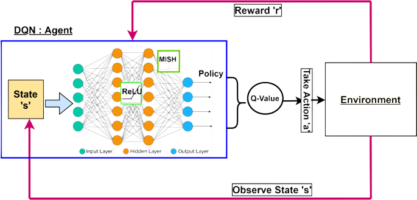
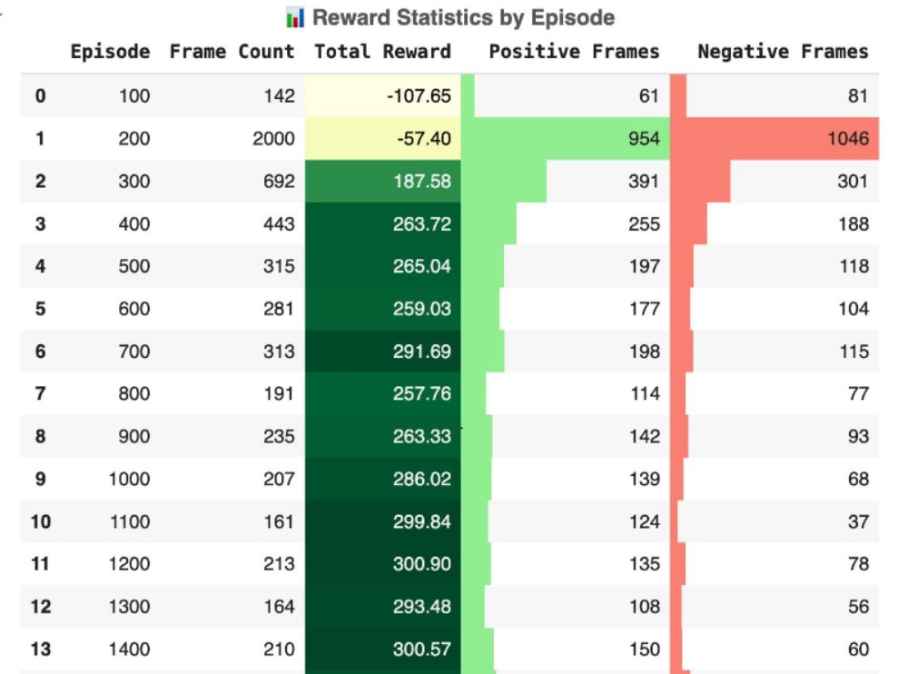
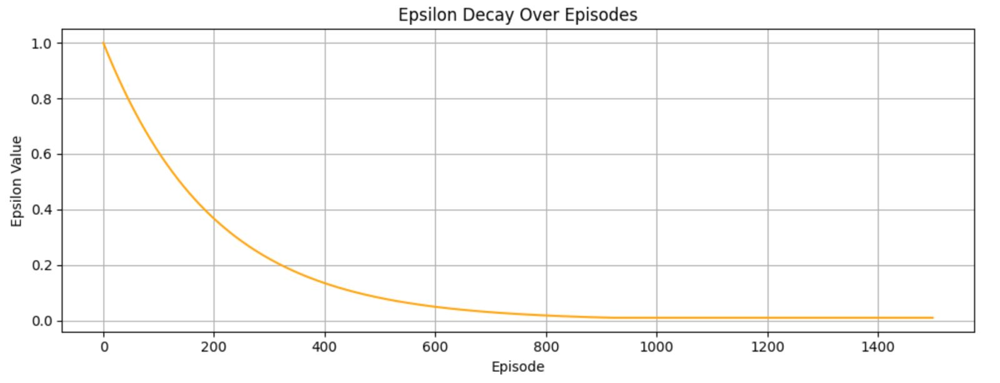
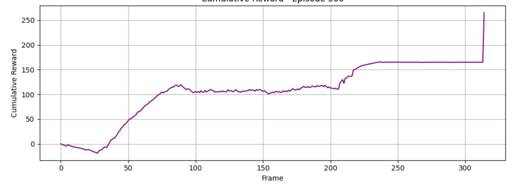
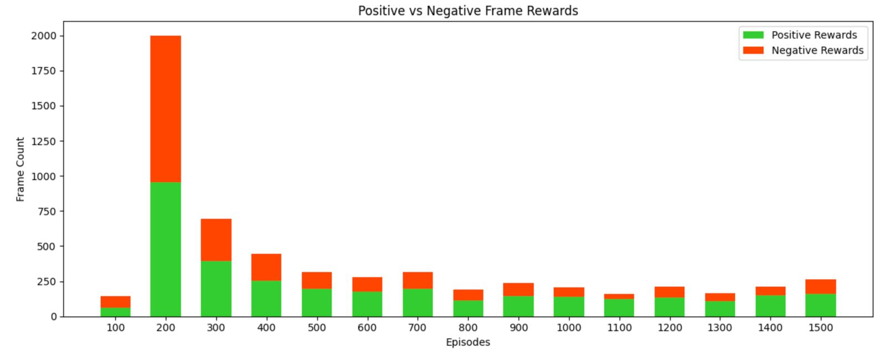
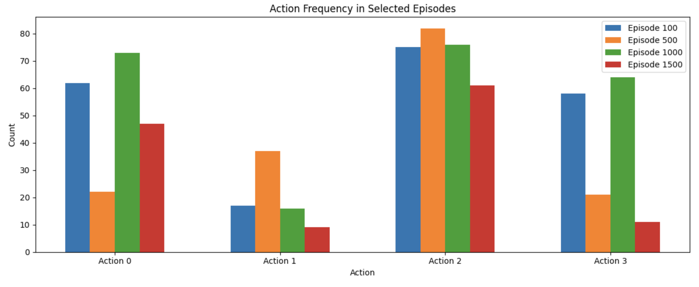
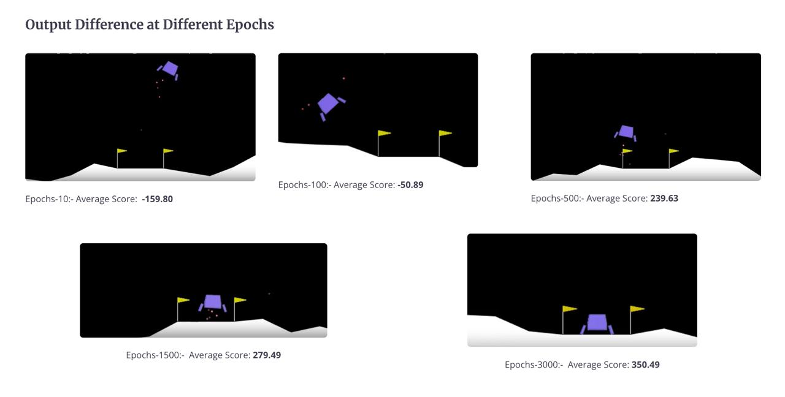
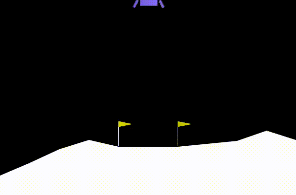
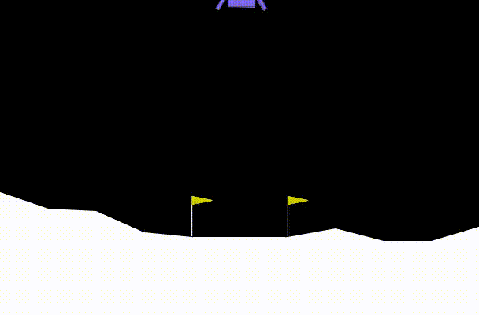

# 🚀 LunarLander-v3: Deep Q-Network Agent

A **deep reinforcement learning** project implementing a **DQN agent** to master the LunarLander-v3 environment using **PyTorch** and **Gymnasium**. This repository captures the end-to-end lifecycle: from theoretical foundations and algorithm design to extensive visual analytics and video demonstrations of agent behavior.

---

## 📘 Project Objective

Design and train a DQN agent capable of safely landing a lunar module between target flags by learning optimal control policies through environment interactions. Key objectives:
- Formulate the problem as a **Markov Decision Process (MDP)**.
- Utilize a **neural network** to approximate the **Q-function**.
- Incorporate **experience replay** and **target network** updates for stable learning.
- Provide rich visual insights: frame-wise reward breakdowns, statistical charts, and side‑by‑side video comparisons.

---

## 🧠 Theoretical Foundation

### 🔹 Markov Decision Process (MDP)
An MDP is defined by the tuple \((\mathcal{S}, \mathcal{A}, P, R, \gamma)\), where:
- \(\mathcal{S}\): state space (8-dimensional landing state)
- \(\mathcal{A}\): action space (4 discrete engine commands)
- \(P(s'|s,a)\): state transition probabilities
- \(R(s,a)\): reward function
- \(\gamma\): discount factor

### 🔹 Q-Learning & Bellman Equation
The **action-value** function \(Q(s,a)\) satisfies the Bellman optimality equation:
```math
Q(s,a) \;=\; \mathbb{E}\left[r + \gamma \max_{a'} Q(s',a') \mid s, a\right]
```

### 🔹 Deep Q-Network (DQN)
DQN uses a neural network parameterized by \(\theta\) to approximate \(Q(s,a;\theta)\). Key stabilizing techniques:
1. **Experience Replay**: sample mini‑batches from a replay buffer to break correlation.
2. **Target Network**: maintain a separate network with parameters \(\theta'\) that updates slowly:
```math
\theta' \leftarrow \tau \theta + (1-\tau) \theta'
```
3. **Epsilon-Greedy**: choose a random action with probability \(\epsilon\), otherwise select \(\arg\max_a Q(s,a)\).

---

## 🏗️ Model Architecture & Hyperparameters

```text
Network:
  • Input layer: 8 units
  • Hidden layer 1: 64 units, ReLU
  • Hidden layer 2: 64 units, ReLU
  • Output layer: 4 units (Q-values for each action)
```

```python
# Training Hyperparameters
learning_rate = 5e-4
batch_size = 64
gamma = 0.99
tau = 1e-3
buffer_capacity = int(1e5)
epsilon_start = 1.0
epsilon_end = 0.01
epsilon_decay = 0.995
update_every = 4  # training step frequency
```

---

## 🎮 Environment Details (LunarLander-v3)

| Property       | Description                                                 |
|---------------:|:------------------------------------------------------------|
| **State**      | 8-dimensional vector (pos, vel, angle, contact flags)      |
| **Actions**    | {0: no-op, 1: left, 2: main, 3: right}                      |
| **Rewards**    | +100–140 landing; -100+ crash; +10 leg contact; -0.3/frame |
| **Episode End**| crash, out-of-bounds, or max 2000 steps                     |



*Figure: LunarLander-v3 state components and action mappings.*

---

## 🧪 Training Workflow

The agent is trained using a structured loop composed of an outer episode loop and an inner time-step loop. Here's the complete training procedure:

### 🔁 Initialization
- Instantiate the local Q-network and target Q-network.
- Create a replay buffer with fixed capacity.
- Set initial values for epsilon and other hyperparameters.

### 🎬 Episode Loop (up to 3000 episodes)
For each episode:

1. Reset the environment to get the initial state.
2. Initialize per-episode reward and step counters.
3. Begin time-step loop:

   #### 🔄 Time Step Loop
   - Select action a using ε-greedy policy:
     ```python
     action = argmax(Q(s,a)) if random > epsilon else random_action()
     ```
   - Execute the action in the environment.
   - Receive next state s′, reward r, and done flag.
   - Store transition (s, a, r, s′, done) in the replay buffer.
   - If buffer has enough samples and it's time to update:
     - Sample a minibatch of transitions.
     - Compute Q-targets and loss.
     - Perform gradient descent on the loss.
   - Every τ steps: soft-update the target network.
   - Update state s ← s′.
   - Accumulate reward.
   - Break if done is True.

4. Decay epsilon:
   ```python
   epsilon = max(epsilon_end, epsilon_decay * epsilon)
   ```

5. Log the total episode reward, number of steps, and Q-value summaries.
6. Save model if average score over last 100 episodes ≥ 300.

---

## 📊 Training Metrics & Results

### Epoch-Wise Performance
| Episodes | Avg. Score |
|---------:|-----------:|
| 10       | -159.80    |
| 100      | -50.89     |
| 500      | 239.63     |
| 1500     | 279.49     |
| 3000     | 350.49     |


*Table: Average episode score at various training stages.*

### Epsilon Decay
Agent transitions from exploration to exploitation as training progresses.



### Reward Curve
Cumulative reward per episode demonstrating learning progression.



### Stacked Reward Analysis
Positive vs. negative reward components per episode.



### Action Frequency Over Epochs
Engine usage trends across early and late training phases.



### Output Difference at Key Epochs
Confidence gap (max Q − second max Q) at selected episodes.



### Frame-Level Reward Distributions
Available in `/reward_frame_plots/` for episodes 100, 500, 1500, 3000.

---

## 🎥 Agent Behavior Demonstrations

<table>
  <tr>
    <th>Early Training (Ep 100)</th>
    <th>Final Trained Agent (Ep 3000)</th>
  </tr>
  <tr>
    <td>
      <a href="video/landing_fail_ep100.mp4">
        
      </a>
    </td>
    <td>
      <a href="video/landing_perfect_ep3000.mp4">
        
      </a>
    </td>
  </tr>
</table>

<p align=""><i>Click GIFs to watch full MP4 videos of agent behavior</i></p>

---

## 📂 Repository Structure

```bash
lunarlander-dqn-agent/
├── Deep_Q_Learning.ipynb        # Jupyter notebook with code & logs
├── video/                       # MP4 demo videos
│   ├── landing_fail_ep100.mp4
│   └── landing_perfect_ep3000.mp4
├── gifs/                        # Preview GIFs
│   ├── landing_fail.gif
│   └── landing_perfect.gif
├── assets/                      # Figures for README
├── requirements.txt             # Dependencies
└── README.md                    # Project overview (this file)
```

---

## ⚙️ Setup & Usage

**Clone & Install**
```bash
git clone https://github.com/Rudravyas233/lunarlander-dqn-agent.git
cd lunarlander-dqn-agent
pip install -r requirements.txt
```

**Run Training / Analysis**
```bash
jupyter notebook Deep_Q_Learning.ipynb
```

**Playback Demos**
- Open MP4s under `video/` or GIFs under `gifs/`

---

## 🔗 Dependencies
```txt
torch>=1.8
gymnasium[box2d]
matplotlib
numpy
seaborn
imageio
moviepy
```

---

## 📜 License
MIT License

---

## 👤 Author
**Rudra Vyas**  
B.Tech in ICT, PDEU  
🔗 GitHub: [@Rudravyas233](https://github.com/Rudravyas233)
